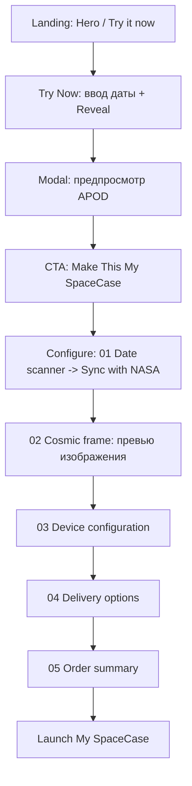

## SpaceCase MVP — аудит контента и визуального дизайна (Ирландия)

Дата: 2026-03-18  
Фокус: фронтенд (`frontend/`) — landing и страница конфигурации (`/configure/upload`).  
Цель: проверить связность продуктовой истории, маркетинговую правдивость относительно текущего MVP, качество текстов/карточек/заголовков, порядок секций, и дать приоритетные рекомендации для роста конверсии на старте (рынок: Ирландия, аудитория: англоязычные).

---

## 1) Коротко о текущем MVP (чтобы аудит был “truthful”)

По текущему коду:
- Пользователь вводит дату → фронтенд запрашивает NASA APOD через API (`fetchApod`).
- На landing есть интерактивный просмотр APOD и переход на `/configure/upload?date=...`.
- На странице конфигурации есть предпросмотр изображения NASA на “фрейме телефона”, выбор модели устройства и варианта доставки.
- Кнопка “Launch My SpaceCase” на конфигурации сейчас только `console.log` (нет оплаты/чекаута/печати/интеграции производства).

При этом в пользовательском контенте (тексты и визуальные кейсы) уже заявлены: “AI restoration”, “printed edge-to-edge”, “production”, “shipped with tracking”, “UV-cured ink”.

### Вывод (критично)
**Для MVP на этапе “ещё не подключены реставрация/печать” контент нужно либо:**
1) официально позиционировать как **Preview / Beta / Coming soon** (и правдиво описать, что именно происходит сейчас), либо  
2) немедленно привести тексты/иллюстрации в соответствие текущей функциональности.

Если этого не сделать, можно получить: недоверие, высокий refund/chargeback риск, негативные отзывы (“обещали одно, получили другое”).

---

## 2) Схема продуктового пути (user journey) и где контент “ломается”

### Узкие места по контенту
- “AI restoration / print / production” обещаются на landing и в визуальных секциях, но пользователю по факту показывается **NASA APOD preview**.
- На конфигурации нет CTA-результата: “Launch My SpaceCase” не приводит к заказу.

---

## 3) Архитектура landing: порядок секций и соответствие навигации

Текущий порядок в `LandingPage`:
1) `HeroSection`
2) `HowItWorksSection` (якорь `how-it-works`)
3) `TechnicalExcellenceSection` (якорь `case-anatomy`)
4) `AIRestorationSection` (якорь `restoration`)
5) `StoriesSection` (якорь `gallery`)
6) `TryNowSection` (дата + предпросмотр)
7) `GuaranteesSection` (доверие/доставка)
8) `FAQSection` (якорь `faq`)
9) `FinalCTASection`

Навигация в `Header`:
- Restoration → `#restoration`
- Case Anatomy → `#case-anatomy`
- Gallery → `#gallery`
- FAQ → `#faq`

### Что работает
- Якоря совпадают с ID секций.
- Логика “показать ценность → показать процесс → доказать → FAQ → CTA” выдержана.

### Что мешает конверсии (контентная логика)
1) **Раннее доверие**: раздел “Guarantees & delivery” стоит после TryNow. В среднем пользователь принимает решение раньше, когда уже видит, как выглядит продукт/preview, и хочет ответы “а как это будет доставлено/оплачено?”.  
2) **Отсутствие соцдоказательства в landing**: есть `TestimonialsSection` и `Reviews`, но они нигде не подключены в `LandingPage`. При покупке кастомного товара (и тем более “по дате”) соцдоказательство почти всегда повышает конверсию.
3) **Тон обещаний**: “AI/print/production” звучит как факт, хотя это фактически не подтверждается UI.

---

## 4) Аудит контента по секциям (тексты, карточки, заголовки)

Ниже — проверка каждой секции по 4 критериям:
- цель секции
- текущая формулировка (что говорит)
- риск (что может вызвать сомнение/нестыковку)
- рекомендации (что изменить)

---

### 4.1 Hero (`HeroSection`)
**Цель:** сформировать “hook” и первый CTA в конфигуратор.
**Текущие тексты:**
- Badge: “Powered by NASA”
- H1: “The sky remembers. Carry it.”
- Subtitle: “Pick a date that changed your world. We turn its NASA sky into a print‑grade, AI‑restored case…”
- CTA 1: “Discover My Sky” → `/configure/upload`
- CTA 2: “how it works” → `#how-it-works`

**Риск (truthfulness + юридический/бренд):**
- “Powered by NASA” + “Official NASA imagery” без явного дисклеймера “мы не аффилированы с NASA”.
- “AI-restored” и “print-grade” заявлены как результат, но MVP пока показывает APOD preview.

**Рекомендации:**
- Добавить **мини-дисклеймер рядом с NASA badge** (1 строка, мелким кеглем):  
  “NASA APOD imagery is sourced from NASA’s Astronomy Picture of the Day. SpaceCase is not affiliated with NASA.”
- Заменить формулировки в Hero на верные относительно MVP, например:  
  - вместо “AI‑restored, print‑grade” → “Preview the NASA sky from your day. AI restoration & printing coming soon.”  
  - либо оставить “AI restoration” как “in development” с явной маркировкой “Beta”.
- Привести стилистику CTA к единому тону: сейчас есть “Discover My Sky”, “Reveal the Universe”, “Make This My SpaceCase”, “Launch My SpaceCase”. Это не обязательно плохо, но **создаёт ощущение разных продуктов/этапов**. Лучше выбрать один глагольный паттерн.

---

### 4.2 How it works (`HowItWorksSection`)
**Цель:** объяснить путь пользователя “в 4 шага”.
**Текущие шаги:**
1) Pick your date
2) AI restores every pixel
3) Printed edge-to-edge
4) Shipped with tracking

**Ключевой риск:**
- 2–4 шаги звучат как уже реализованная фактическая цепочка.

**Рекомендации:**
- В MVP-правдивой версии сделать как минимум 2 и 3 шаги “coming soon”:  
  2) “AI enhances the archive (beta)” / “AI restoration coming soon”  
  3) “Print production (activated after beta)”  
  4) “Shipping starts after production is enabled”
- Если печать/производство действительно уже работает на другой системе (backend), но UI не показывает — нужен хотя бы “proof”: сроки, процесс, FAQ подтверждают.

---

### 4.3 Technical Excellence (`TechnicalExcellenceSection`)
**Цель:** “engineering credibility”: материалы, стойкость, качество печати.
**Текущие элементы:**
- Заголовок: “Anatomy of a SpaceCase” / “Engineered for orbit.”
- Карточки: “Long-lasting durability”, “Polished finish”, “Vibrant non-fade prints”, “Dual-layer protection”, “Top-grade materials”, “Lightweight strength”.

**Риск:**
- Тексты про “prints”, “UV-cured ink”, “300+ DPI” усиливают ожидания, но UI не показывает реальный restored/printed результат.

**Рекомендации:**
- До подключения настоящей реставрации/печати лучше перенести эти аргументы в режим “spec preview”:  
  “Designed for a premium outcome (beta rendering)”  
  или заменить “prints” на “restored preview quality targets”.
- На уровне визуала: на мобильных карточках есть кликабельность, но **нет явного текста-пояснения**, почему меняется активная фича. Добавьте 1 строку под заголовком или в подзаголовке секции (“Tap to explore the anatomy”).

---

### 4.4 AI Restoration (`AIRestorationSection`)
**Цель:** визуально доказать “до/после” и объяснить процесс.
**Текущие элементы:**
- Compare-slider “Before / After”
- Подпись: “Many NASA images date back decades. Our neural network reconstructs every pixel…”
- 3 карточки: “Signal Acquisition / Neural Synthesis / Chromatic Mastering”

**Критичный риск:**
- До/после в слайдере сейчас, судя по коду, использует статичные изображения `before.png` и `after.jpg`. Важно маркировать их как **пример/демо**, иначе пользователь будет думать, что это именно его дата будет восстановлена аналогично.
- “Our neural network reconstructs every pixel” — очень сильное утверждение.

**Рекомендации:**
- Вверху секции добавить маленький бейдж/подпись:  
  “Example restoration preview (demo)”
- В карточках и subtitle сделать тон “target/goal”:  
  “AI enhances detail for print-ready clarity (beta)”  
  “aims for 300+ DPI” / “optimized for print”.

---

### 4.5 Stories (`StoriesSection`)
**Цель:** сделать продукт эмоциональным и персональным.
**Текущие элементы:**
- “Every important date is already stored in space”
- 6 историй: Child’s birthday / Parents’ anniversary / First meeting / Personal breakthrough / Graduation day / Big move abroad

**Что хорошо:**
- Есть конкретика (дата, контекст), это снижает абстрактность.
- Визуальная презентация через `Phone`-карточки — сильная.

**Риск:**
- Если на реальном этапе AI/print не работает, то “этот кейс теперь у вас каждый день” может оказаться слишком обещающе.

**Рекомендации:**
- Часть описаний смягчить:  
  вместо “printed on a case they use every day” → “designed to become a case you’ll use every day” / “the print-ready design starts from this NASA moment”.

---

### 4.6 Try it now (`TryNowSection`)
**Цель:** дать интерактивный “момент истины”: дата → APOD preview → CTA в конфигурацию.
**Текущие элементы:**
- Title: “See what the universe looked like on your day”
- Subtitle: “This is the exact image we&apos;ll restore with AI and print…”
- Кнопка: “Reveal the Universe”
- Modal CTA: “Make This My SpaceCase” → configure

**Риск (прямое несоответствие MVP):**
- “exact image we’ll restore with AI and print” — обещание будущего результата.
- Если APOD для даты не “image”, код делает `console.warn` и не показывает UI-ошибку пользователю.

**Рекомендации:**
- Текст subtitle переписать так, чтобы он описывал текущую механику:  
  “Preview the NASA Astronomy Picture of the Day for your date. AI restoration & printing will follow (beta).”
- Добавить пользовательскую ошибку в modal/inline:  
  “No suitable image for this date. Try another day.”
- Дать дополнительную “снятие тревоги” в modal:  
  “Next: choose your device model and shipping option.”

---

### 4.7 Guarantees & delivery (`GuaranteesSection`)
**Цель:** доверие и снижение perceived risk.
**Тексты:**
- “Safe purchase, predictable delivery”
- “3–5 business days”, “Tracked delivery”, “Quality guarantee”, “Secure payments”
- delivery note: estimated dates at checkout before you pay

**Риск:**
- “Secure payments” обещает обработку платежей и защиту картовых данных, но на конфигурации сейчас нет чекаута.
- “Quality guarantee” обещает ре-апрув/ре-принт/рефанд. Если нет production — нужно либо “beta guarantee” с ограничениями, либо не обещать так категорично.

**Рекомендации:**
- Если платежей ещё нет: переписать Guarantees так, чтобы гарантии были **про процессы предпросмотра**:  
  “We’ll confirm production readiness before charging you” / “Payment will be enabled once beta selection is ready”.
- Важно для Ирландии: добавить “VAT/customs included” или “VAT may be added at checkout” (в зависимости от модели).

---

### 4.8 FAQ (`FAQSection`)
**Цель:** закрыть возражения до CTA.
**Вопросы:**
- Where do the images come from?
- What if the image… too dark?
- Can I add text?
- Which phone models do you support?
- What happens if… damaged / doesn't fit?
- How long… receive order?

**Ключевой риск:**
- “Can I add text to my case?” в UI сейчас не реализовано.

**Рекомендации:**
- Для несделанных функций: либо удалить/перефразировать (“Text caption coming soon”), либо отметить “available in beta”.
- Для Ирландии обязательно добавить FAQ-пункты (как минимум один):  
  - “Do you ship to Ireland? How long does delivery take?”  
  - “Is VAT included in the price?”  
  - “What’s your returns policy?”

---

### 4.9 Final CTA (`FinalCTASection`)
**Цель:** повторить оффер и подтолкнуть к началу.
**Тексты:**
- “Your sky is waiting. Don’t let it fade.”
- Цена: “Starting from €39” / “Express from €49”
- included list
- CTA: “Discover My Sky”
- “It takes less than 2 minutes. All you need is a date.”

**Риск:**
- На configure странице “Total” = только выбранная доставка (39 или 49). Это должно совпадать с бизнес-моделью. Если продукт стоит дороже/есть базовая стоимость — сейчас копирайт будет вводить в заблуждение.

**Рекомендации:**
- Проверить математику цены и отразить в копи (например “Shipping included, production price added at checkout” или “Total includes production + shipping” — в зависимости от реальности).
- “less than 2 minutes” — ок как мотивация, но можно сделать точнее: “about 2 minutes” или “2 minutes (date + device + delivery)”.

---

## 5) Аудит визуального дизайна (UI дизайн-система)

### 5.1 Токены бренда и типографика
- Пара шрифтов: `Recursive` (моно) и `Plus_Jakarta_Sans` (display).
- Brand palette из `globals.css`: Cosmic Pink `#CB7CFD`, Midnight Purple `#4D30FF`, основа Space Black `#020207`.
- Механика “glass card”, badges, тех-стиль `font-technical`.

**Оценка:** визуально целостно, современно, “premium tech” айдентика выдержана.

### 5.2 Motion и интерактивы
- Orbit/фон в Hero (радар-пульс сетка).
- Compare-slider (before/after) с кастомным handle.
- Mobile nav с framer-motion анимацией.

**Риск для MVP:** визуалы “AI restoration” + статический after картинка требуют дисклеймера “demo”.

### 5.3 Согласованность страниц (Landing vs Configure)
Landing:
- тёмный фон, glass-карточки, светлый текст.
Configure:
- светлые карточки `bg-white`, а заголовок `Header` остаётся `bg-transparent backdrop-blur`.

**Риск для контраста:** sticky header на белом фоне может стать менее читаемым (с точки зрения пользователя это “сломанный” дизайн — даже если CSS формально есть).

**Рекомендации:**
- Для `/configure/upload` сделать header “solid” (semi-transparent surface) или менять классы по роуту/контексту.
- Сохранить бренд-акцент (pink/purple) даже в белом checkout-блоке: например, highlight для активного шага, тонкий градиент или border-glow.

---

## 6) Локализация и рынок Ирландии (content fit)

### 6.1 Даты
- В Stories и timeline используются `DD.MM.YYYY` форматы.
- В Ирландии чаще встречается `DD/MM/YYYY`. Это не критично, но может снизить ощущение “локальной аккуратности”.

**Рекомендация:** унифицировать формат даты по одному стандарту во всех местах (stories, scanner, FAQ).

### 6.2 Цена и налоги
- Везде евро и фиксированные суммы доставки.
- Нет явного текста про VAT/налоги/доставку в Ирландию (DDP vs ex-VAT).

**Рекомендация (обязательная строка):**
- “Prices include VAT where applicable” или “VAT may be added at checkout” (в зависимости от реальности).

### 6.3 Доставка
- Указаны сроки 7–12 / 2–4 business days и перевозчики DHL/DPD.

**Рекомендация:** добавить “Ireland delivery” и где именно формируется трекинг (и когда).

---

## 7) Самые важные “gap’ы” контента (приоритеты)

### P0 (делать немедленно, иначе риск доверия и платежей)
1) Привести обещания “AI restoration / print / production” к текущей реальности MVP (Preview/Beta/Come soon + демо-подписи).
2) Добавить дисклеймер про NASA (не аффилированы + источник APOD).
3) Починить/смягчить обещания в FAQ и Guarantees (убрать “Can I add text”, если не реализовано; переписать “Secure payments”, если чекаута нет).
4) На “Try it now” обработать случай “APOD не image”: показать пользователю текст ошибки.
5) На конфигурации: “Launch My SpaceCase” должен вести к следующему шагу (или явно объяснять, что это предзаявка/бета).
6) Футер содержит ссылки на `/legal/terms` и `/legal/privacy`, но страниц в фронтенде не найдено. Для рынка Ирландии это бьёт по доверию и может блокировать запуск по комплаенсу.

### P1 (рост конверсии)
1) Вставить соцдоказательство в landing: подключить `TestimonialsSection`/`Reviews` или другой модуль.
2) Переработать порядок для доверия: часть Guarantee можно поднять ближе к TryNow (или добавить мини-блок “Tracked delivery + guarantee” сразу под модальным preview).
3) Устранить стилистическую “разноголосицу” CTA (единый глагольный стиль).

### P2 (полировка качества)
1) Единый формат даты (DD/MM или DD.MM).
2) Роут-специфическая стилизация header для читаемости.
3) Уточнить тексты “300+ DPI / edge-to-edge / UV ink” в зависимости от фактической стадии.

---

## 8) “Словарь” текущих пользовательских сообщений (для единообразия бренда)

Чтобы привести всё к одной тональности, удобно сделать “контентную контрактную” таблицу (одинаковые формулировки в разных местах):
- “Reveal the Universe” vs “Sync with NASA” vs “Discover My Sky”
- “Make This My SpaceCase” vs “Launch My SpaceCase”
- “AI restoration” vs “restored preview” vs “printed”

Рекомендация: выбрать 2–3 ключевые формулировки и использовать их везде.

---

## 9) Предлагаемая целевая структура landing для MVP (конверсионная IA)

Вариант (без кардинального рефакторинга кода):
1) Hero (с точной правдивой формулировкой “Preview + beta”)
2) Try it now (как первичный “moment of proof”)
3) Mini guarantees (2–3 карточки: delivery timeline, secure process, guarantee-beta)
4) How it works (обновить шаги под MVP)
5) Visual deep dives (Technical Excellence + AI Restoration demo with disclaimer)
6) Stories (эмоциональный блок)
7) Testimonials (включить существующий TestimonialsSection)
8) FAQ (с beta-состоянием функций)
9) Final CTA

---

## 10) Контент-чеклист на выпуск MVP в Ирландии

1) NASA/APOD дисклеймер (на видном месте).
2) Beta/Coming soon метки для AI restoration/печати (если не активировано).
3) VAT/налоги строка.
4) “Доставка в Ирландию” + точные сроки и процесс трекинга.
5) Соцдоказательство (минимум 3–6 отзывов/визуальных кейсов).
6) FAQ без невыполненных обещаний.
7) “Launch” CTA должен либо вести в checkout, либо называться корректно: “Request your SpaceCase (beta)” / “Get early access”.

---

## 11) Что я бы сделал дальше (следующий шаг для команды)

1) Определить: что реально включено в MVP (AI? печать? производство? оплаты?)  
2) На этой основе отредактировать тексты:
   - Hero subtitle
   - How it works steps
   - AIRestoration subtitle + “demo” подпись
   - Guarantees + FAQ
   - TryNow modal copy
   - “Launch My SpaceCase” label/микротекст
3) Подключить соцдоказательство в landing (TestimonialsSection / Reviews) и провести A/B по размещению Guarantees.

Конкретные правки текста можем сделать сразу, если вы подтвердите “что уже работает” и “что реально запланировано” по срокам.

